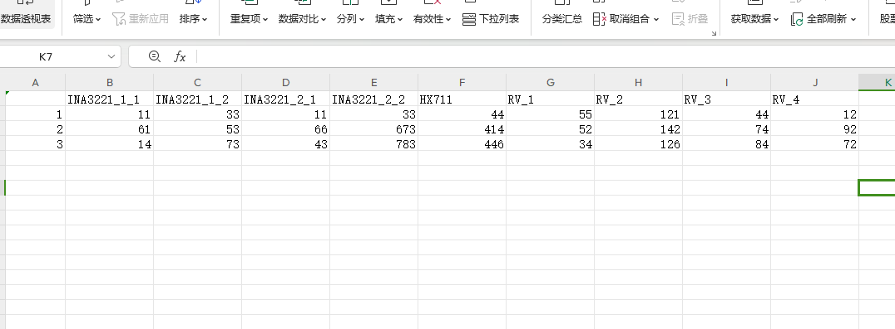

# micropython_csv
USE_CSV
### 简单使用
```
from csv import CSV
f=CSV()
#默认生成当前总文件数目的csv文件(若当前目录下只有1个文件，生成1.csv)
f.cols(["INA3221_1_1","INA3221_1_2","INA3221_2_1","INA3221_2_2","HX711","RV_1","RV_2","RV_3","RV_4"])
#创建第一行表头
f.add_data([11,33,11,33,44,55,121,44,12])
#添加第一行数据(需要你按照顺序，生成一个列表)
f.add_data([61,53,66,673,414,52,142,74,92])
#添加第二行数据
f.add_data([14,73,43,783,446,34,126,84,72])
#添加第三行数据
f.close()
#添加完成
```

使用excel打开文件:



### TF卡 SD卡使用
#### SD卡接线
|TF卡|PICO|
|-|-|
|vcc| 3v3|
|GND| gnd|
|cs| GP13|
|clk| GP10|
|mos| GP11|
|mis| GP8|

*传感器的数据请先安装自己定义顺序（第一行表头的顺序）的生成列表。*

```
from machine import SPI,Pin
import os,sdcard
from csv import CSV
sdi = SPI(1, baudrate=8000000,  sck=Pin(10), mosi=Pin(11), miso=Pin(8))
sd = sdcard.SDCard(sdi, Pin(13))
sdfile=os.VfsFat(sd)
os.mount(sdfile,'/sd')
os.chdir("sd")

f=CSV()
#默认生成当前总文件数目的csv文件(若当前目录下只有1个文件，生成1.csv)
f.cols(["INA3221_1_1","INA3221_1_2","INA3221_2_1","INA3221_2_2","HX711","RV_1","RV_2","RV_3","RV_4"])
#创建第一行表头
f.add_data([11,33,11,33,44,55,121,44,12])
#添加第一行数据(需要你按照顺序，生成一个列表)
f.add_data([61,53,66,673,414,52,142,74,92])
#添加第二行数据
f.add_data([14,73,43,783,446,34,126,84,72])
#添加第三行数据
f.close()
#添加完成

print(os.listdir())
#查看当前SD卡目录下的文件
```
